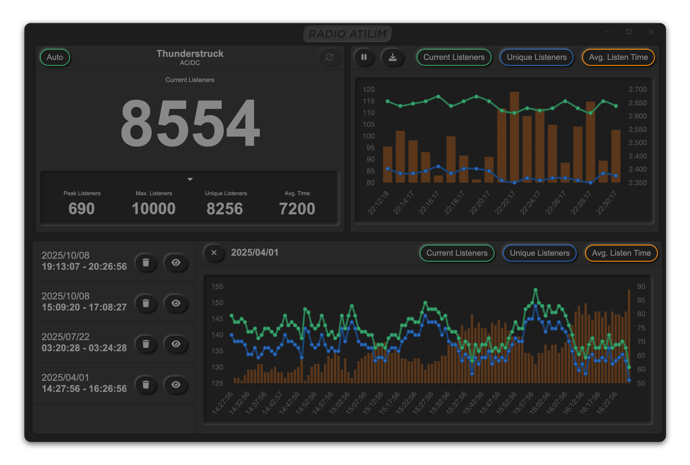

# Radio Atılım Statistics Monitor
A utility developed for <b>RADIO ATILIM</b> to show streaming statistics.
## Features
- Sleek <b>Neumorphic GUI</b> providing a professional look and feel
- Statistics updated <b>real-time</b> and recorded on <b>timelines</b> (Max. 120 records per timeline)
- A <b>timeline manager</b> which lists each timeline <b>chronologically</b> and allows you to <b>preview</b> them
- Double-click on the <b>title of the songs</b> and listen them on [Radio Atılım's Website](radioatilim.com)


## Project setup
```
npm install
```

### Compiles and starts the application in debug mode
```
npm run build
```

### Compiles and packages the application as a standalone distributable, generating a dedicated installer depending on the platform desired.
For macOS, to generate a <b>.dmg</b> file (Electron builder version should be <b>23.0.2</b>):
```
npm run dist-mac
```

For Windows, to generate an <b> Executable Installer (.exe)</b> file (Electron builder version should be <b>22.14.13</b>):
```
npm run dist-win
```

### Compiles Vue components for development
This will allow you to preview the GUI in browser while editing templates and the stylesheets. However, since it lacks access to Electron's main process ( which it heavily depends on), most core functionalities will not work.
```
npm run serve
```

### Lints and fixes files
```
npm run lint
```

### Customize configuration
See [Configuration Reference](https://cli.vuejs.org/config/).
